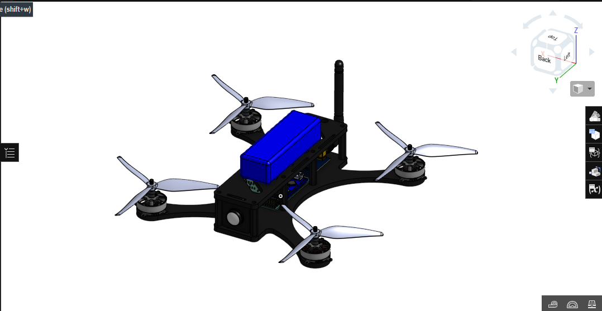
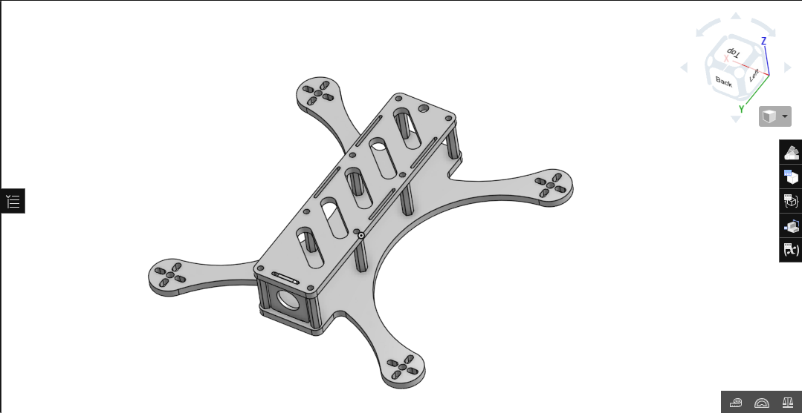
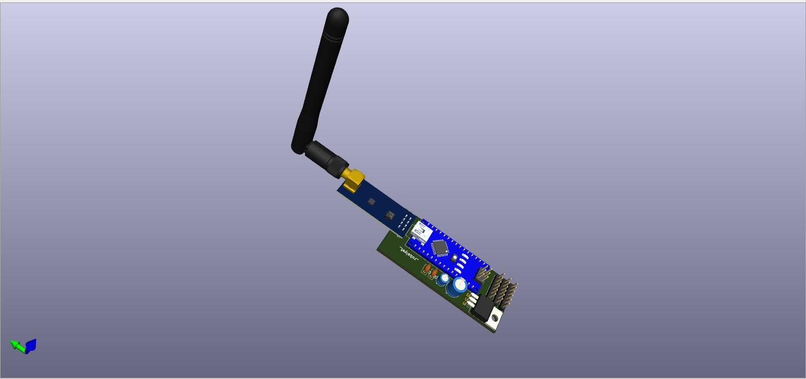
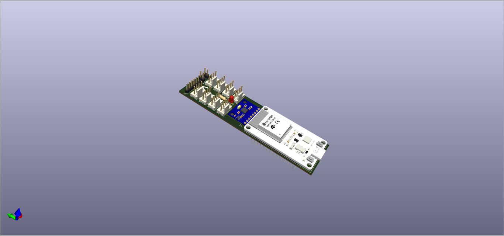
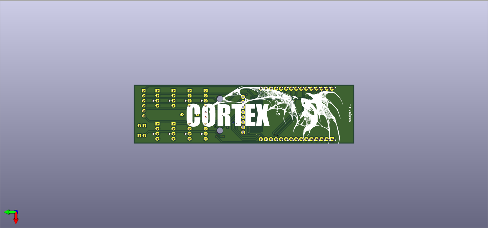
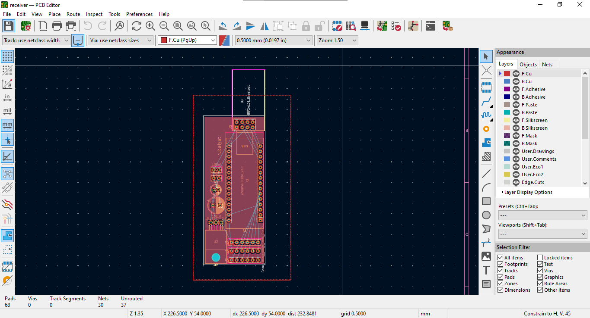
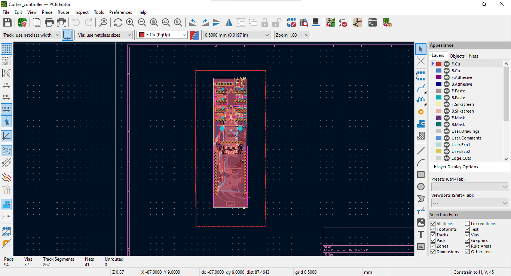
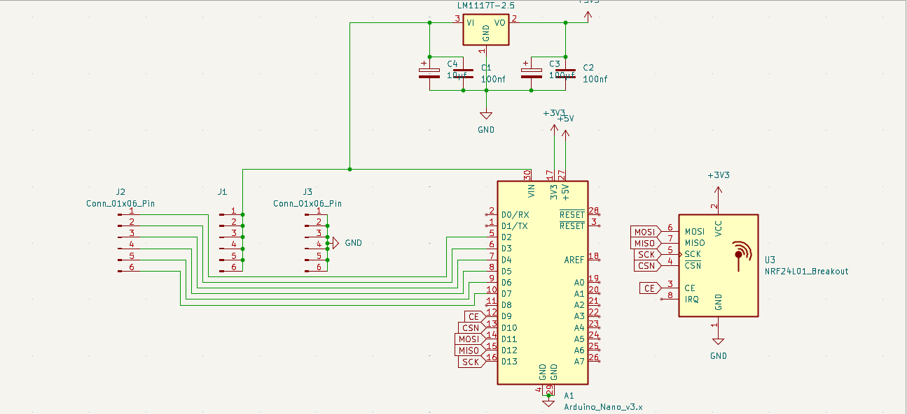
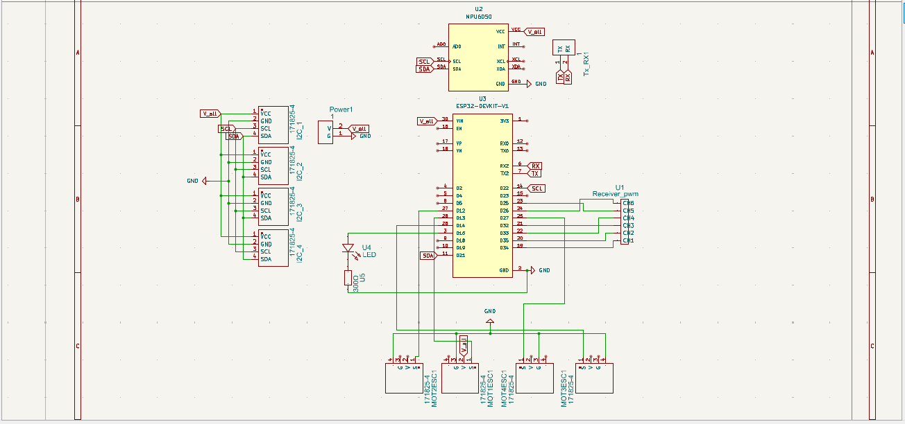

## GHOST-1

A Drone made with a transceiver and flight controller that I made. There is nothing much to say about this because it speaks for itself. Well it's ment to  be fast. And one of the most fun thing about this is its fully diy. From the trasmitter to the flight controller.  The firmware for the flight controller is from opensource Betaflight github. 

## Controlling

This is the transmitter that's used. Checkout https://github.com/VampireBandit/Transceiver_101

## Cortex

The flight controller is called "Cortex". This is made using an esp32 and an MPU6050 module. This will allow the drone to be able to load Betaflight firmware in it. The betaflight firmware is taken from the git for the open source betaflight. 

## BOM
| Name | Purpose | Quantity | Total Cost | Link | Distributor |
| :--- | :--- | :--- | :--- | :--- | :--- |
| **NRF module** | radio transmission | 1 | 5.42 | [Link](https://wv) | Aliexpress |
| **Esp32_cAM** | Camera | 1 | 12.82 | [Link](https://wv) | Aliexpress |
| **Arduino_nano** | Receiver node | 1 | 5 | [Link](https://wv) | Aliexpress |
| **ESC_mini** | Speed control | 4 | 19.18 | [Link](https://wv) | Aliexpress |
| **5" drone props** | Propulsion | 4 | 37.66 | [Link](https://wv) | Aliexpress |
| **6s 1400mah** | power | 1 | 19.13 | [Link](https://wv) | Aliexpress |
| **BLDC motor** | Motor | 4 | 76.46 | [Link](https://wv) | Aliexpress |
| **Esp32** | flight_control | 1 | 7.77 | [Link](https://ali) | Aliexpress |
| **pcb** | Flight control | 5 | 20 | [Link](https://jlc) | jlcpcb |
| **Frame** | The drone frame | 1 | 50 | [Link](https://jlc) | jlc3dp |
| **Male headers** | connection | 8 | 4.33 | [Link](https://wv) | Aliexpress |
| **Female Headers** | Mounting | 56 | 6.36 | [Link](https://wv) | Aliexpress |
| **100nf capacitor** | Voltage capping | 2 | 1.07 | [Link](https://wv) | Aliexpress |
| **10uf capacitor** | Voltage regulation | 2 | 0.93 | [Link](https://s.c) | Aliexpress |
| **100uf capacitor** | Voltage regulation | 1 | 2.06 | [Link](https://s.c) | Aliexpress |
| **Arduino Nano** | MCU | 1 | 8.7 | [Link](https://wv) | Aliexpress |
| **Antenna** | Receiver antenna | 1 | 4.75 | [Link](https://wv) | Aliexpress |
| **Receiver Module** | Radio transmission | 1 | 5.62 | [Link](https://wv) | Aliexpress |
| **LM1117T-3.3** | Voltage regulator | 1 | 13.44 | [Link](https://wv) | Aliexpress |
| **Grand Total** | | | **300.7** | | |

Made by Rubaiyat_Islam
